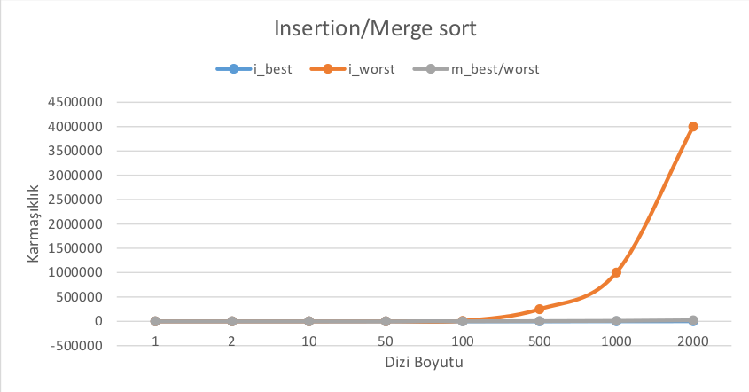

**Name:** Ebru 
**Surname:** Simsek  
**Email:** ebrusimsek201@gmail.com 

### ALGORITHM ANALYSIS PROJECT

This project compares the time complexity of sequential, reverse ordered, and randomly ordered arrays with the different number of elements for "Insertion Sort" and "Merge Sort" in terms of running time and the general formula.

### The Menu and Project

### Comparison of Running Time 

### Comparison of General Formula  

### Graphs

